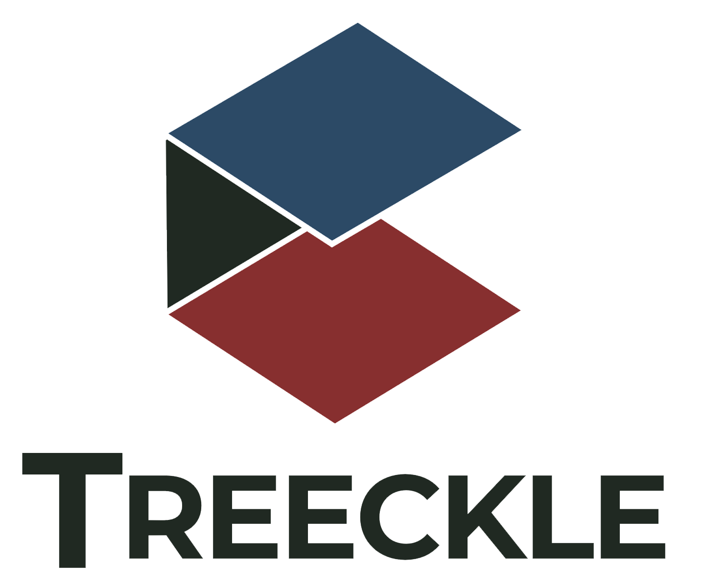

# Treeckle 3.0

  

Website: <https://treeckle.com/>

_**Currently in production**_

Treeckle is a student life app for the Residential Colleges of NUS, intended to be a platform for the efficient booking of facilties, and the creation and management of events.

For usage/contribution, please contact [@JermyTan](https://github.com/JermyTan)

## Contributions Guidelines

### Commits/PR

- Use squash and merge
- PR by issue/feature
- Use github issues

### Backend

- Use venv
- [Style](https://google.github.io/styleguide/pyguide.html)
- Use snake_case, 4 spaces indentations and CONSTANT_VARIABLE
- Use list comphension
- Include constant file
- Use double quotes for strings

### Frontend

- Only use yarn (no npm)
- Typescript only in src file
- Component files use tsx, utils function files use ts
- Define constants instead of magic string
- Use enums
- Declare API response type
